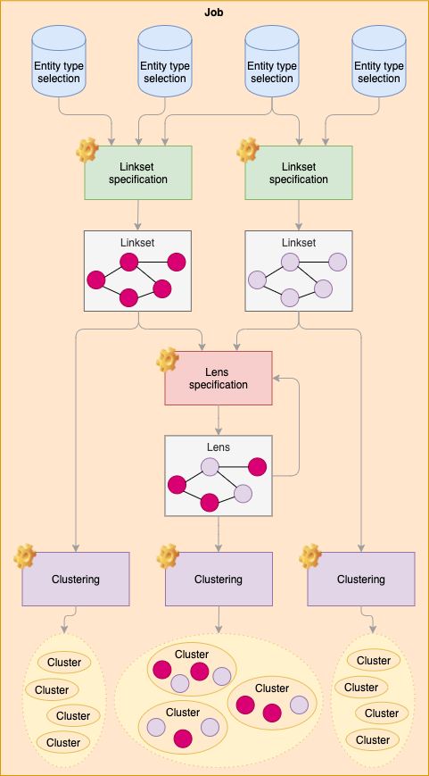

# Lenticular Lenses

Lenticular Lenses is a tool which allows users to construct linksets between entities 
from different Timbuctoo datasets (so called data-alignment or reconciliation). 
Lenticular Lenses tracks the configuration and the algorithms used in the alignment 
and is also able to report on manual corrections and the amount of manual validation done.

1. [Installation with Docker](#installation-with-docker)
1. [Definition of terms](#definition-of-terms)
1. [API](#api)
    1. [Default](#default)
    1. [Job creation and updates](#job-creation-and-updates)
    1. [Job processes](#job-processes)
    1. [Data retrieval](#data-retrieval)
    1. [Linksets interaction](#linksets-interaction)
    1. [Export](#export)
1. [Job configuration with JSON](#job-configuration-with-json)
    1. [Entity-type selections](#entity-type-selections)
    1. [Linkset specs](#linkset-specs)
    1. [Lens specs](#lens-specs)
    1. [Element groups](#element-groups)
    1. [Property paths](#property-paths)
1. [Matching methods](#matching-methods)
    1. [Levenshtein distance](#levenshtein-distance)
    1. [Soundex](#soundex)
    1. [Bloothooft Reduction](#bloothooft-reduction)
    1. [Trigram distance](#trigram-distance)
    1. [Time Delta](#time-delta)
    1. [Same Year/Month](#same-yearmonth)
    1. [Distance is between](#distance-is-between)
    1. [Normalized / Similarity](#normalized--similarity)
    1. [Future matching methods](#future-matching-methods)

## Installation with Docker

1. Make sure Docker and Docker Compose are installed
    * _For Windows and Mac users: install [Docker Desktop](https://www.docker.com/products/docker-desktop)_
1. Use the provided `docker-compose.yml` as a baseline
1. Run `docker-compose up`
1. Visit http://localhost:8000 in your browser

_Note: This will create a folder `pgdata` with the database data. 
To clean up the database and start from scratch, simply remove this folder._

## Definition of terms



*   **Job**
    
    A **job** encloses a research question, which highlights the scope/context 
    in which _linksets_ and _lenses_ are created, analysed, validated and exported.

*   **Entity-type selection**
    
    An **entity-type selection** is a selection of entities (stemmed from a dataset) 
    of a certain type based on zero or more filters. 
    The set of _entity-type selections_ in a _job_ comprises the entities of interest for a research question.
    
*   **Linkset specification** 
    
    A **linkset specification** is the specification determining how entities from one or more _entity-type selections_
    should be matched using one or more entity matching algorithms. 
    Running a _linkset specification_ will result in a _linkset_.

*   **Linkset**
    
    A **linkset** is a set of paired resources (URIs)
    that matched according to a _linkset specification_.
    
*   **Lens specification**
    
    A **lens specification** is the specification that specifies one or more modifications 
    (union, intersection, ...) over a number of _linksets_ or _lenses_. 
    The _lens_ inherits the specifications of all _linksets_ and _lenses_ it originates from.
    
*   **Lens**
    
    A **lens** is a set of paired resources (URIs)
    resulting from one or more modifications according to a _lens specification_.

*   **Clustering**
    
    A **clustering** is the partitioning of the resources (URIs) in a _linkset_ or _lens_ 
    into _clusters_ based on transitivity of the links in the _linkset_ or _lens_.
    
*   **Cluster**
    
    A **cluster** is a set of potentially similar resources (URIs). 
    As a _cluster_ originates from the _clustering_ of a _linkset_ or a _lens_, 
    the _cluster_ holds only with respect to their _linkset specifications_.

## API

### Default

**URL**: `/`\
**Method**: `GET`

Root page. Will return the GUI for the tool. 

---

**URL**: `/datasets`\
**Method**: `GET`\
**Parameters**: `endpoint`, `hsid`

Returns all available datasets for a specific Timbuctoo GraphQL `endpoint`. 
If logged in, specify the `hsid` to obtain the private datasets.

_Example: `/datasets?endpoint=https://repository.goldenagents.org/v5/graphql`_

---

**URL**: `/downloads`\
**Method**: `GET`

Returns all currently running data downloads and finished data downloads from Timbuctoo.

---

**URL**: `/download`\
**Method**: `GET`\
**Parameters**: `endpoint`, `hsid`, `dataset_id`, `collection_id`

Starts a data download from Timbuctoo from the given Timbuctoo GraphQL `endpoint`.
If logged in, specify the `hsid` to obtain a private datasets.
Use `dataset_id` to specify from which dataset to download 
and `collection_id` to specify the collection from the dataset to download.

_Example: `/download?endpoint=https://repository.goldenagents.org/v5/graphql&dataset_id=ufab7d657a250e3461361c982ce9b38f3816e0c4b__ecartico_20190805&collection_id=schema_Person`_

---

**URL**: `/association_files`\
**Method**: `GET`\

Returns all available association_files.

### Job creation and updates

**URL**: `/job/create`\
**Method**: `POST`\
**JSON**: `job_title`, `job_description`

Creates a new job with the given `job_title` and `job_description`. 
Returns the identifier of this new job.

---

**URL**: `/job/update`\
**Method**: `POST`\
**JSON**: `job_id`, `job_title`, `job_description`, `job_link`, `entity_type_selections`, `linkset_specs`, `lens_specs`

Updates a job with the given `job_id`. 
Updates the `job_title`, `job_description`, `job_link`, `entity_type_selections`, `linkset_specs` and `lens_specs`.

---

**URL**: `/job/<job_id>`\
**Method**: `GET`

Returns the details of a job with the given `job_id`.

_Example: `/job/d697ea3869422ce3c7cc1889264d03c7`_

### Job processes

**URL**: `/job/<job_id>/linksets`\
**Method**: `GET`

Returns the details of all linksets with the given `job_id`.

_Example: `/job/d697ea3869422ce3c7cc1889264d03c7/linksets`_

---

**URL**: `/job/<job_id>/lenses`\
**Method**: `GET`

Returns the details of all lenses with the given `job_id`.

_Example: `/job/d697ea3869422ce3c7cc1889264d03c7/lenses`_

---

**URL**: `/job/<job_id>/clusterings`\
**Method**: `GET`

Returns the details of all clustering jobs with the given `job_id`.

_Example: `/job/d697ea3869422ce3c7cc1889264d03c7/clusterings`_

---

**URL**: `/job/<job_id>/run_linkset/<linkset>`\
**Method**: `POST`\
**JSON**: `restart`

Start a linkset process for the given `linkset` of a specific `job_id`. 
Specify `restart` to restart the process.

_Example: `/job/d697ea3869422ce3c7cc1889264d03c7/run_linkset/0`_

---

**URL**: `/job/<job_id>/run_lens/<lens>`\
**Method**: `POST`\
**JSON**: `restart`

Start a lens process for the given `lens` of a specific `job_id`. 
Specify `restart` to restart the process.

_Example: `/job/d697ea3869422ce3c7cc1889264d03c7/run_lens/0`_

---

**URL**: `/job/<job_id>/run_clustering/<type>/<id>`\
**Method**: `POST`\
**JSON**: `association_file`, `clustering_type`

Start a clustering process of `type` (`linkset` or `lens`) 
for the linkset/lens with the given `id` of a specific `job_id`. 
Specify an `association_file` to reconcile a given cluster.
Specify `clustering_type`, which is `default` by default.

_Example: `/job/d697ea3869422ce3c7cc1889264d03c7/run_clustering/linkset/0`_

---

**URL**: `/job/<job_id>/kill_linkset/<linkset>`\
**Method**: `POST`\
Stop a linkset process for the given `linkset` of a specific `job_id`. 

_Example: `/job/d697ea3869422ce3c7cc1889264d03c7/kill_linkset/0`_

---

**URL**: `/job/<job_id>/kill_lens/<lens>`\
**Method**: `POST`\
Stop a lens process for the given `lens` of a specific `job_id`. 

_Example: `/job/d697ea3869422ce3c7cc1889264d03c7/kill_lens/0`_

---

**URL**: `/job/<job_id>/kill_clustering/<type>/<id>`\
**Method**: `POST`

Stop a clustering process of `type` (`linkset` or `lens`) 
for the linkset/lens with the given `id` of a specific `job_id`.

_Example: `/job/d697ea3869422ce3c7cc1889264d03c7/kill_clustering/lens/0`_

---

**URL**: `/job/<job_id>/<type>/<id>`\
**Method**: `DELETE`

Deletion of `type` (`linkset` or `lens`) for the linkset/lens with the given `id` of a specific `job_id`.

_Example: `/job/d697ea3869422ce3c7cc1889264d03c7/lens/0`_

### Data retrieval

**URL**: `/job/<job_id>/entity_type_selection_total/<label>`\
**Method**: `GET`

Returns the total number of entities for an entity-type selection with the label `label` of the given `job_id`.

_Example: `/job/d697ea3869422ce3c7cc1889264d03c7/entity_type_selection_total/LimitedPersons`_

---

**URL**: `/job/<job_id>/links_totals/<type>/<id>`\
**Method**: `GET`\
**Parameters**: `cluster_id`, `limit`, `offset`

Returns the total number of links of `type` (`linkset` or `lens`) for the linkset/lens with `id` of the given `job_id`.
Use `limit` and `offset` for paging.
Specify `cluster_id` to only return the links of a specific cluster.

_Example: `/job/d697ea3869422ce3c7cc1889264d03c7/links_totals/linkset/0`_

---

**URL**: `/job/<job_id>/entity_type_selection/<label>`\
**Method**: `GET`\
**Parameters**: `limit`, `offset`

Returns all data for an entity-type selection with the label `label` of the given `job_id`.
Use `limit` and `offset` for paging.

_Example: `/job/d697ea3869422ce3c7cc1889264d03c7/entity_type_selection/LimitedPersons`_

---

**URL**: `/job/<job_id>/links/<type>/<id>`\
**Method**: `GET`\
**Parameters**: `cluster_id`, `limit`, `offset`

Returns the links of `type` (`linkset` or `lens`) for the linkset/lens with `id` of the given `job_id`.
Use `limit` and `offset` for paging.
Specify `cluster_id` to only return the links of a specific cluster.

_Example: `/job/d697ea3869422ce3c7cc1889264d03c7/links/linkset/0`_

---

**URL**: `/job/<job_id>/clusters/<type>/<id>`\
**Method**: `GET`\
**Parameters**: `association`, `limit`, `offset`

Returns the clusters of `type` (`linkset` or `lens`) for the linkset/lens with `id` of the given `job_id`.
Use `limit` and `offset` for paging.
Specify `association` to include reconciliation results with the given association.

_Example: `/job/d697ea3869422ce3c7cc1889264d03c7/clusters/0`_

### Linksets interaction

**URL**: `/job/<job_id>/validate/<type>/<id>`\
**Method**: `POST`\
**JSON**: `source`, `target`, `valid`

Validate a link of `type` (`linkset` or `lens`) for the linkset/lens with `id` of the given `job_id`.
Specify the uris of the `source` and `target` to identify the link to be validated.

Provide `valid` with either `accepted` or `declined` to validate the link or use `not_validated` to reset.  

---

**URL**: `/job/<job_id>/cluster/<type>/<id>/<cluster_id>/graph`\
**Method**: `GET`\
**Parameters**: `get_cluster`, `get_cluster_compact`, `get_reconciliation`

Get the visualization information for a cluster with `cluster_id` of `type` (`linkset` or `lens`) 
for the linkset/lens with `id` of the given `job_id`.
Specify `get_cluster` to obtain the default visualization.
Specify `get_cluster_compact` to obtain the compact visualization.
Specify `get_reconciliation` to obtain the reconciled visualization.

### Export

**URL**: `/job/<job_id>/export/<type>/<id>/csv`\
**Method**: `GET`\
**Parameters**: `valid`

Get a CSV export of `type` (`linkset` or `lens`) for the linkset/lens with `id` the given `job_id`.

Specify `valid` with `accepted` to include the accepted links.
Specify `valid` with `declined` to include the declined links.
Specify `valid` with `not_validated` to include the links which were not yet validated.
Specify `valid` with `mixed` to include the links which have mixed validations in the various linksets of the lens.

## Job configuration with JSON

### Entity-type selections
~~~~
Entity-type selections is a list of JSON objects that contain the configuration 
of the specific entity-type selections to use for a particular job.

```json5
{
    "id": 1,                    // An integer as identifier  
    "label": "My dataset",      // The label of the entity-type selection in the GUI
    "description": "",          // A description of this entity-type selection by the user; optional field
    "dataset": {                // The data to use from Timbuctoo
        "dataset_id": "ufab7d657a250e3461361c982ce9b38f3816e0c4b__ecartico_20190805",   // The identifier of the dataset to use
        "collection_id": "foaf_Person",                                                 // The identifier of the collection from this dataset to use
        "published": true,                                                              // Whether the dataset is published on Timbuctoo or not; optional field, defaults to 'true'
        "timbuctoo_graphql": "https://repository.goldenagents.org/v5/graphql",          // The GraphQL interface of the Timbuctoo instance
        "timbuctoo_hsid": null                                                          // The hsid if the dataset is not published; optional field
    },
    "filter": {                 // The filter configuration to obtain only a subset of the data from Timbuctoo; optional field
        "conditions": [{        // The filter is composed of element groups
            "property": ["foaf_name"],    // The property path to which this condition applies
            "type": 'minimal_date',       // The type of filtering to apply; see table below for allowed values
            "value": "1600",              // Depends on type of filtering selected; value to use for filtering
            "format": "YYYY-MM-DD"        // Both the types `minimal_date` and `maximum_date` require a date format for parsing
        }],
        "type": "AND"           // Whether ALL conditions in this group should match ('AND') or AT LEAST ONE condition in this group has to match ('OR')
    },
    "limit": -1,                // Apply a limit on the number of entities to obtain or -1 for no limit; optional field, defaults to '-1'
    "random": false,            // Randomize the entities to obtain or not; optional field, defaults to 'false'
    "properties": [             // A list of property paths to use for obtaining sample data; optional field
        ["foaf_name"]
    ],
    "related": [],              // Work in progress
    "related_array": false      // Work in progress
}
```        

| Filtering             | Key                   | Value                         |
| :-------------------- | :-------------------- | :---------------------------- | 
| Equal to              | `=`                   | Yes                           |
| Not equal to          | `!=`                  | Yes                           |
| Has no value          | `is_null`             | No                            |
| Has a value           | `not_null`            | No                            |
| Contains              | `ilike`               | Yes _(Use % as a wildcard)_   |
| Does not contain      | `not_ilike`           | Yes _(Use % as a wildcard)_   |
| Minimal               | `minimal`             | Yes _(An integer)_            |
| Maximum               | `maximum`             | Yes _(An integer)_            |
| Minimal date          | `minimal_date`        | Yes _(Use YYYY-MM-DD)_        |
| Maximum date          | `maximum_date`        | Yes _(Use YYYY-MM-DD)_        |
| Minimal appearances   | `minimal_appearances` | Yes _(An integer)_            |
| Maximum appearances   | `maximum_appearances` | Yes _(An integer)_            |

### Linkset specs

Linkset specs is a list of JSON objects that contain the configuration 
of the linksets to generate for a particular job.

```json5
{
    "id": 1,                    // An integer as identifier  
    "label": "My linkset",      // The label of the linkset in the GUI
    "description": "",          // A description of this linkset by the user; optional field
    "is_association": false,    // Work in progress; optional field, defaults to 'false'
    "sources": [1],             // The identifiers of entity-type selections to use as source
    "targets": [1],             // The identifiers of entity-type selections to use as targets
    "methods": {                // The matching configuration for finding links; requires at least one condition
        "conditions": [{        // The matching configuration is composed of element groups
            "method_name": "=",               // The type of matching to apply; see table below for allowed values
            "method_value": {},               // Some types of matching methods require extra configuration
            "sources": [{                     // The source properties to use during matching
                "entity_type_selection": 1,         // The identifier of the entity-type selection to use
                "property": ["schema_birthDate"],   // The property path to which this condition applies
                "transformers": [{                  // The transformers to apply to transform the value before matching; see table below for allowed values
                    "name": "PARSE_DATE",
                    "parameters": {
                        "format": "YYYY-MM-DD"
                    }
                }]                  
            }],
            "targets": [{                     // The target properties to use during matching
                "entity_type_selection": 1,
                "property": ["schema_birthDate"],
                "transformers": []
            }]
        }],
        "type": "AND"           // Whether ALL conditions in this group should match ('AND') or AT LEAST ONE condition in this group has to match ('OR')
    },
    "properties": [{            // A list of property paths to use for obtaining data while reviewing the linkset; optional field
        "entity_type_selection": 1,           // The identifier of the entity-type selection to use
        "property": ["schema_birthDate"]      // The property path
    }]
}
```

| Matching method                   | Key                           | Values                                                                                            |
| :-------------------------------- | :---------------------------- | :------------------------------------------------------------------------------------------------ | 
| Exact Match                       | `=`                           |                                                                                                   |
| Levenshtein distance              | `LEVENSHTEIN`                 | `max_distance` (Maximum distance)                                                                 |
| Approximated Levenshtein          | `LEVENSHTEIN_APPROX`          | `threshold` (Similarity threshold)                                                                |
| Approximated Soundex              | `LL_SOUNDEX`                  | `threshold` (Similarity threshold)                                                                |
| Approximated Bloothooft Reduction | `BLOOTHOOFT_REDUCT`           | `name_type` (First or last name: `first_name`, `family_name`), `threshold` (Similarity threshold) |
| Similar Bloothooft Reduction      | `BLOOTHOOFT_REDUCT_APPROX`    | `name_type` (First or last name: `first_name`, `family_name`), `threshold` (Similarity threshold) |
| Trigram distance                  | `TRIGRAM_DISTANCE`            | `threshold` (Similarity threshold)                                                                |
| Time Delta                        | `TIME_DELTA`                  | `days` (Number of days), `multiplier` (Multiplier)                                                |
| Same Year/Month                   | `SAME_YEAR_MONTH`             | `date_part` (Year, month, or both: `year`, `month`, `year_month`)                                 |
| Distance is between               | `DISTANCE_IS_BETWEEN`         | `distance_start` (Start), `distance_end` (End)                                                    |

_Note: See [Matching methods](#matching-methods) for a description and examples of these matching methods._

| Transformer   | Key               | Values                    |
| :------------ | :---------------- | :------------------------ | 
| Parse date    | `PARSE_DATE`      | `format` (Date format)    |
| Parse numeric | `PARSE_NUMERIC`   | 
| Prefix        | `PREFIX`          | `prefix` (The prefix)     |
| Suffix        | `SUFFIX`          | `suffix` (The suffix)     |

### Lens specs

Lens specs is a list of JSON objects that contain the configuration 
of the lenses to apply on a combination of linksets.

```json5
{
    "id": 1,                    // An integer as identifier  
    "label": "My lens",         // The label of the lens in the GUI
    "description": "",          // A description of this lens by the user; optional field
    "specs": {                  // The lens configuration; requires groups consisting of two elements
        "elements": [{          // The lens configuration is composed of element groups
            "id": 0,            // The identifier of the linkset/lens to use
            "type": "linkset"   // The type (linkset or lens)
        }],
        "type": "UNION"         // Lens type to apply; see table below for allowed values
    },
    "properties": [{            // A list of property paths to use for obtaining data while reviewing the lens; optional field
        "entity_type_selection": 1,           // The identifier of the entity-type selection to use
        "property": ["schema_birthDate"]      // The property path
    }]
}
```

| Lens type      | Description                                                                              |
| :------------- | :--------------------------------------------------------------------------------------- |
| UNION          | Union (A ∪ B) All links of both linksets                                                 |
| INTERSECTION   | Intersection (A ∩ B) Only links that appear in both linksets                             |
| DIFFERENCE     | Difference (A - B) Only links from the first linkset, not from the second linkset        |
| SYM_DIFFERENCE | Symmetric difference (A ∆ B) Only links which appear in either one linkset, but not both |

### Element groups

The entity-type selections (using the filter), the linkset specs (using the matching methods) 
and the lens specs (using the elements) all apply element groups to allow the user the express complex conditions.

```json5
{
    "elements": [],       // The list of elements; may contain other element groups (can have any JSON key)
    "type": "AND"         // The type that combines these elements (usually AND/OR, but can be of any type)
}
```

As element groups may contain other element groups, complex conditions can be expressed.

```json5
{
    "conditions": [{
        "conditions": [{}, {}, {}],
        "type": "OR"
    }, {
        "conditions": [{
            "conditions": [{}],
            "type": "AND"
        }, {}],
        "type": "OR"
    }], 
    "type": "AND"
}
```

### Property paths

A property path is a list of values that expresses the path in the linked data from the entity to a specific property.
The list has at least one value: the property to select on the entity. 
If the property is a reference to another entity, 
you have to specify another value in the list with the id of the entity it points to.
Then you can select the specific property on the referenced entity.
If this is again a reference to another entity, the cycle repeats itself until you reach the required property.

```json5
["property", "entity", "property", "entity", "property"]
```

If you want the reference as a value, rather then selecting a property on the referenced entity, 
there is a special value `__value__` that you can use.

```json5
[
     // Get the name of a person: select the property 'foaf_name'
    ["foaf_name"],                                
    // Get the name of a parent of a person: follow the property 'schema_parent' to the parent entity and select the property 'foaf_name' 
    ["schema_parent", "foaf_Person", "foaf_name"],
    // Get the name of a grandparent of a person: follow the property 'schema_parent' to the parent entity, then follow that property again and then select the property 'foaf_name'
    ["schema_parent", "foaf_Person", "schema_parent", "foaf_Person", "foaf_name"],
    // Get the reference of the parent of a person (the uri of this parent): follow the property 'schema_parent' and use the special value '__value__'
    ["schema_parent", "__value__"]
]
```

## Matching methods

### Exact Match

Exact match is a string-based metric that allows for zero error 
between a pair of sequence of characters (word or token). 
It returns 0 in the event that there is at least one character mismatch or 1 for a perfect match.

```
Exact_Match(cat, chat) = 0
Exact_Match(cat, cat) = 1
```

### Levenshtein distance

Levenshtein distance is a string-based metric for computing the similarity between two sequences. 
It translates to the number of character editing operations required to change one sequence into the other.

**Character Edits:**
- Insertion 
- Deletion 
- Substitution = (Deletion and insertion)
    
```
Levenshtein(kitten, sitten) = 1
Levenshtein(sitting, sittin) = 1
Levenshtein(intention, execution) = 5
```

|**1**|**1**|**1**|**0**|**1**|**1**|**0**|**0**|**0**|**0**|
|:---:|:---:|:---:|:---:|:---:|:---:|:---:|:---:|:---:|:---:|
|  i  |  n  |  t  |  e  |     |  n  |  t  |  i  |  o  |  n  |
|     |  e  |  x  |  e  |  c  |  u  |  t  |  i  |  o  |  n  | 

### Soundex

Soundex is a phonetic algorithm for indexing names by sound, as pronounced in English. 
The goal is for homophones to be encoded to the same representation 
so that they can be matched despite minor differences in spelling.

```
Soundex(Robert) = R163
Soundex(Rupert) = R163
Soundex(Rubin) = R150
```

### Bloothooft Reduction

_TO DO_

### Trigram distance

_TO DO_

### Time Delta

_TO DO_

### Same Year/Month

_TO DO_

### Distance is between

_TO DO_

### Normalized / Similarity

Normalization is a function to bound the result of method between 0 and 1.
Often meaning a score of 0 implies the dissimilarity between the pair of string while 1 implies a perfect match.

```
Levenshtein(intention, execution) = 5
Length(intention) = 9
Length(execution) = 9
Relative_Similarity = 1 - (5 / 9) = 0.666
```

### Future matching methods

Suggestions on other generic matching methods to add:
- TF-IDF
- N-Grams
- Intermediate Dataset
- Cosine Similarity
- Jaro-Winkler
- Needleman Wunsch
- Smith-Waterman
- Metaphone
- ...
